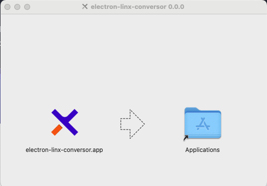
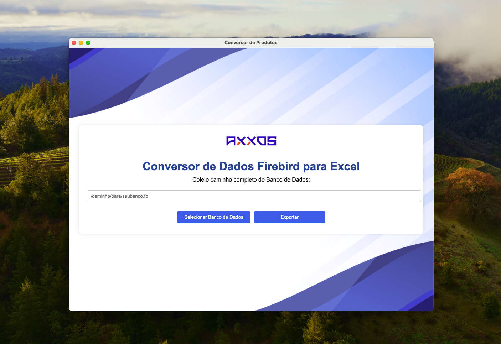

# Conversor de Dados Firebird para Excel com Electron

Este projeto é uma aplicação desktop desenvolvida com **Electron** que permite a exportação de dados de um banco de dados Firebird específico para um arquivo Excel. A aplicação oferece uma interface simples e intuitiva para facilitar a exportação e importação de dados.

## Pré-requisitos

Antes de iniciar, certifique-se de ter os seguintes componentes instalados em sua máquina:

* **Node.js** : Plataforma JavaScript que permite executar a aplicação Electron.
* **npm** : Gerenciador de pacotes Node.js para instalar as dependências do projeto.
* **Firebird** : Sistema de gerenciamento de banco de dados que será acessado pela aplicação.
* **Git** : Para clonar o repositório do projeto.
* **Acesso ao banco de dados Firebird** que você deseja converter.

## Instalação

### 1. Clone o Repositório

Primeiro, faça o download do código fonte clonando o repositório do projeto:

```
git clone https://github.com/edutrindade/conversor-electron

cd conversor-electron
```

### 2. Instale as Dependências

Instale as dependências do projeto listadas no arquivo `package.json`:

```
npm install
```

### 3. Configuração do Banco de Dados

Verifique se o banco de dados Firebird está acessível e ajuste o caminho para o banco de dados no arquivo `main.js`, utilizando as credenciais corretas para acesso.

## Executando a Aplicação

### 1. Inicie o Servidor de Desenvolvimento

Ative o servidor de desenvolvimento com o seguinte comando:

```
npm run dev
```

### 2. Execute o Electron

Abra uma nova janela de terminal e execute:

```
npm run electron
```

### 3. Utilize a Aplicação

* **Selecionar Banco de Dados** : Clique no botão "Selecionar Banco de Dados" para escolher o arquivo do banco de dados Firebird. Opcionalmente, você pode digitar também o caminho do banco.
* **Exportar Dados** : Clique no botão "Exportar" para iniciar o processo de conversão. Um arquivo Excel será gerado e disponibilizado para download.

    	


## Construção do Executável

### 1. Crie o Executável

Use o **electron-builder** para criar um executável da sua aplicação:

```
npm run build
npm run dist
```

* O executável gerado estará na pasta `dist`. Você pode distribuir este arquivo para os clientes, que poderão executá-lo diretamente em suas máquinas.
* Execute o executável gerado para garantir que ele funciona corretamente e acessa o banco de dados local. Se preferir utilizar na nuvem, lembre-se de hospedar a base de dados e ajustar as configurações de acesso.

## Considerações Finais

* Teste em diferentes ambientes para garantir a compatibilidade.

---

Esse README cobre as principais etapas para configurar, executar e distribuir sua aplicação Electron. Se precisar de mais detalhes ou ajustes, sinta-se à vontade para perguntar! 😁
